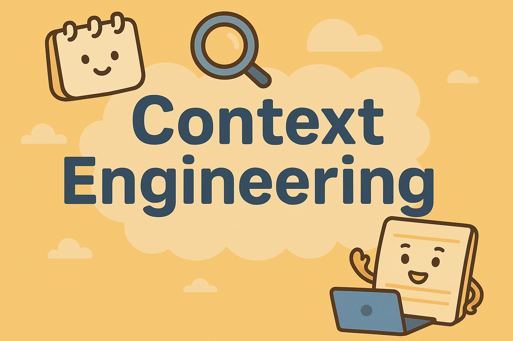

# 大模型应用开发 - 上下文工程实践指南

  

  <h2>📚 上下文工程实践指南</h2>
  
<em>从理论到实践，从基础到进阶，构建你的上下文工程体系</em>

<!-- https://github.com/WakeUp-Jin/Practical-Guide-to-Context-Engineering -->

  
  
  

  
  
  

## 项目介绍
&emsp;&emsp; 随着大语言模型（LLM）的快速发展，越来越多的开发者和企业尝试将其应用到实际业务场景中。然而，在真实落地的过程中，大家很快发现：模型本身并不是一切，决定模型表现的关键在于它所拥有的上下文。

&emsp;&emsp;上下文工程（Context Engineering）正是在这样的背景下提出的一种系统化方法论。它关注如何在有限的上下文窗口中，选择、组织并注入与用户任务高度相关的信息，从而让大模型在合理的边界内做出最佳推理与执行。

本项目的目标，是为开发者和研究者提供一份 从理论到实践、从基础到进阶 的完整指南，帮助大家在构建 Agent 和大模型应用时，真正把“上下文”作为核心设计要素来对待。

## ✏️什么是上下文工程
**上下文工程的定义：是在有限的上下文窗口中，选择、组织并注入与用户输入或任务高度相关的信息，从而让大语言模型（LLM）能够在合理的边界内做出最佳推理和执行。**

上下文工程中最关键的是：**用最相关的信息填充 LLM 的上下文窗口**

如何为“用户输入”找到最相关的信息，是这个上下文工程系统的入口，也是衡量整个系统价值的核心指标，但这种“相关性”的实现并不会自然而然发生，它依赖开发者去设计、构建与优化整个系统

与 RAG 的区别是：RAG 是上下文工程中的一个子集

与提示词工程的区别是：提示词工程是专注于 LLM 最前置的正确指令艺术，其主要是：在单个文本字符串中设计完美的指令集

>  Karpathy的总结：人们通常将提示与日常使用中向 LLM 提供的简短任务描述联系起来。但在每个工业级 LLM 应用中，上下文工程是一门微妙的艺术和科学，它通过为下一步提供恰到好处的信息来填充上下文窗口。这是科学，因为正确地做到这一点涉及任务描述和解释、少量示例、RAG、相关（可能是多模态的）数据、工具、状态和历史记录、压缩等。太少或形式不正确，LLM 就没有正确的上下文来优化性能。太多或太不相关，LLM 的成本可能会上升，性能可能会下降。做好这一点非常不简单。而且，这也是艺术，因为围绕 LLM 心理和人们精神的指导直觉。
>

Karpathy的总结的链接：[https://x.com/karpathy/status/1937902205765607626?ref=blog.langchain.com](https://x.com/karpathy/status/1937902205765607626?ref=blog.langchain.com)

## ✏️为什么上下文工程重要
🌟🌟 **因为它可以帮助开发者构建真正有效的 AI 代理，为构建 Agent 提供开发方向**

## 上下文工程
.png)
上下文工程的核心由七种上下文组成，同时根据七种上下文可以延伸出来系统或者 Agent 中真正需要构建的模块是哪些，这些模块都是围绕上下文工程来构建的，这个时候我们可以知道构建 Agent 或者大模型应用时，需要哪些基础的技术

其中最关键的，也是最特别的部分是：**相关上下文，**这个对于开发者来说是最有挑战性的，这个变动性是最大的，每一个 Agent 或许都有属于自己独特的相关上下文模块设计的架构

相关上下文是围绕用户输入的**背景知识**，是帮助大模型更好的回答用户输入的问题，例如

1. 在一个编码 Agent 中：一段代码问题是用户的输入，那么根据代码库检索到的这段用户输入相关的代码片段，代码文件，代码关系就是相关上下文
2. 在一个客服 Agent 中：客服手册，常见问题集合，回复规范这些都可以是用户输入的相关上下文
3. 在一个医疗问诊 Agent 中：用户输入“描述自己最近的症状”，那么用户病例、药物使用史，体检报告解释相关上下文
4. 在一个项目管理 Agent 中：用户输入“我们项目 X 的进度怎么样”，那么项目文档，任务进度，周报等就是相关上下文

RAG 只是相关上下文实现的其中一种技术手段，其实还有更多的实现方式，例如：组合记录、标签检索，日期检索等

相关上下文和用户记忆的获取都使用了 RAG（增强检索技术），但是它们的侧重点不同

+ 相关上下文的侧重点是“用户输入”的相关背景知识
+ 用户记忆的侧重点是“用户”的相关数据

然而，**一个 Agent 并不需要同时使用全部七种上下文**。不同的场景、不同的目标，往往只需要其中的若干种组合就能发挥很好的效果。这需要开发者们进行选择

## 上下文组成
.png)
上下文由以下几种类型组成

1. 系统提示词：遵守一些提示词工程的要求定义的提示词，例如：期望输出，结果限制，任务要求
2. 问题相关上下文：解决和回答这个问题想要的背景知识
3. 用户记忆：和用户相关的知识，例如：用户年龄，用户的习惯，用户的偏好等
4. 工具定义和输出：提供相应的工具或者 MCP 给模型调用
5. 会话历史记录：一个会话窗口的历史聊天记录
6. 结构化输出：对于大模型输出的结果有格式的要求：例如：JSON，XML，CSV ，TSV 等
7. 用户输入：用户在当前对话中输入的原始问题或指令，是整个上下文工程的起点。

## 📖 内容导航
| 章节 | 关键内容 | 状态 |
| --- | --- | --- |
| [上下文组成](./docs/前言.md) | 解释上下文的七个核心组成部分，以及为什么它们决定了大模型应用的效果 | 🚧 |
| <strong>第一部分：上下文工程基础技术</strong> |  |  |
| [第一章 数据持久化](./docs/chapter1/第一章%20初识智能体.md) | 介绍传统数据库（MySQL、MongoDB、Redis 等）在大模型应用中的作用：状态存储、用户数据、日志记录 | 🚧 |
| [第二章 向量存储和嵌入模型](./docs/chapter2/第二章%20智能体发展史.md) | 语义检索的底层原理、嵌入模型的选择与评测、主流向量数据库的特性 | 🚧 |
| [第三章 知识图谱](./docs/chapter3/第三章%20大语言模型基础.md) | 知识的结构化表达、实体关系抽取、知识图谱与向量检索的互补 | 🚧 |
| [第四章 RAG技术](./docs/chapter4/第四章%20智能体经典范式构建.md) | 从检索增强生成（RAG）的流程拆解到优化方法，涵盖索引构建、检索策略、融合方式 | ✅ |
| <strong>第二部分：上下文组成工程实践</strong> |  |  |
| [第五章 系统提示词模块](./docs/chapter5/第五章%20基于低代码平台的智能体搭建.md) | 系统提示词的设计方法：输出规范、边界约束、多角色指令，如何平衡稳定性与灵活性 | 🚧 |
| [第六章 工具管理模块](./docs/chapter6/第六章%20框架开发实践.md) | 工具（API、函数、MCP）的注册与调度，调用结果的解析与注入，常见框架中的实现方式 | ✅ |
| [第七章 用户记忆模块](./docs/chapter7/第七章%20构建你的Agent框架.md) | 长期/短期记忆管理，用户画像构建，记忆存储与检索策略，隐私与安全考量 | 🚧 |
| [第八章 会话存储模块](./docs/chapter8/第八章%20推理与规划.md) | 会话历史的截断、压缩与检索；如何在有限上下文窗口内保留对话连贯性 | ✅ |
| [第九章 结构化输出模块](./docs/chapter9/第九章%20记忆与工具.md) | JSON/XML/CSV 等结构化输出的约束与解析，如何让 LLM 严格遵循格式要求 | ✅ |
| [第十章 相关上下文模块](./docs/chapter10/第十章%20智能体通信协议.md) | 如何动态选择与任务最相关的上下文（检索、排序、过滤、融合） | 🚧 |
| [第十一章 LLM模块](./docs/chapter11/第十一章%20多智能体系统.md) | 上下文工程中LLM的设计架构 | ✅ |
| <strong>第三部分：上下文管理</strong> |  |  |
| [第十二章 上下文管理](./docs/chapter12/第十二章%20智能体性能评估.md) | 上下文裁剪、压缩、去重、隔离（quarantine）等策略，性能指标与评估方法 | ✅ |
| [第十三章 Token压缩策略](./docs/chapter13/第十三章%20智能旅行助手.md) | 各类压缩方法对比：摘要、向量聚合、句子窗口检索，结合真实应用案例 | ✅  |
| <strong>第四部分：Agent架构设计</strong> |  |  |
| <strong>第五部分：Agent评估</strong> |  |  |
| <strong>第六部分：上下文工程实践项目</strong> |  |  |

## 🤝 如何贡献

我们是一个开放的开源社区，欢迎任何形式的贡献！

- 🐛 <strong>报告 Bug</strong> - 发现内容或代码问题，请提交 Issue
- 💡 <strong>提出建议</strong> - 对项目有好想法，欢迎发起讨论
- 📝 <strong>完善内容</strong> - 帮助改进教程，提交你的 Pull Request
- ✍️ <strong>分享实践</strong> - 在"社区贡献精选"中分享你的学习笔记和项目

## 🙏 致谢

### 核心贡献者
- [WakeUpJin-项目负责人](https://github.com/WakeUp-Jin) (一位享受阅读和积累知识的开发者)

## Star History

<!-- 

    

 -->

  
⭐ 如果这个项目对你有帮助，请给我们一个 Star！

## 📜 开源协议

本作品采用[知识共享署名-非商业性使用-相同方式共享 4.0 国际许可协议](http://creativecommons.org/licenses/by-nc-sa/4.0/)进行许可。